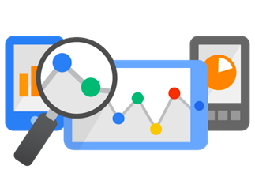
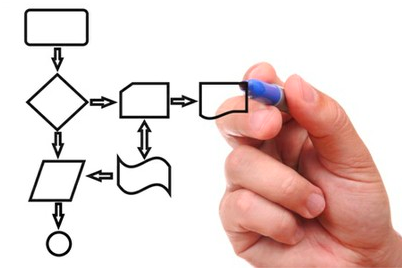
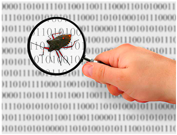
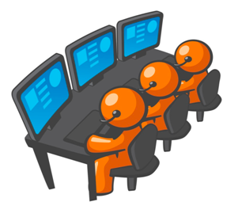

## Стадии цикла разработки ПО

**1. Анализ требований**

Жизненный цикл разработки ПО начинается со стадии анализа, во время которого участники процесса обсуждают требования,
предъявляемые к конечному продукту. Цель этой стадии – определение детальных требований к системе. Кроме этого,
необходимо убедиться в том, что все участники правильно поняли поставленные задачи и то, как именно каждое требование
будет реализовано на практике.

Зачастую, в обсуждении участвуют также и специалисты по тестированию, которые уже на стадии разработки требований могут
вносить собственные пожелания и, при необходимости, корректировать в процессе.

В зависимости от выбранной модели разработки, могут отличаться подходы к определению момента перехода с одной стадии на
другую. К примеру, в каскадной или V-модели стадия анализа требований закрепляется в документе – спецификации требований
к программному обеспечению (Software Requirement Specification, SRS), оформление которого должно быть закончено до
перехода на следующую стадию.

Таким образом, этот этап предполагает **сбор требований** к разрабатываемому программному обеспечению, их
**систематизацию, документирование, анализ**, а также **выявление и разрешение противоречий**.

**2. Проектирование**

На стадии проектирования (называемой также стадией дизайна и архитектуры) программисты и системные архитекторы,
руководствуясь требованиями, разрабатывают высокоуровневый дизайн системы.

Разнообразные технические вопросы, возникающие в процессе проектирования, обсуждаются со всеми заинтересованными
сторонами, включая заказчика. Определяются технологии, которые будут использоваться в проекте, загрузка команды,
ограничения, временные рамки и бюджет. В соответствии с уточненными требованиями выбираются наиболее подходящие
проектные решения.

Утвержденный дизайн системы определяет перечень разрабатываемых программных компонентов, взаимодействие с третьими
сторонами, функциональные характеристики программы, используемые базы данных и многое другое. Дизайн, как правило,
закрепляется отдельным документом – дизайн-спецификацией (Design Specification Document, DSD).

На этом этапе для упрощения визуализации процесса проектирования используются так называемые **нотации** – схематическое
выражение характеристик разрабатываемой системы. Основные используемые нотации:

- Блок-схемы;
- ER-диаграммы;
- UML-диаграммы;
- Макеты – например, нарисованный в фотошопе прототип сайта.

**3. Разработка и программирование**

После того как требования и дизайн продукта утверждены, происходит переход к следующей стадии жизненного цикла –
непосредственно разработке. Здесь начинается написание программистами кода программы в соответствии с ранее
определенными требованиями.

Системные администраторы настраивают программное окружение, front-end программисты разрабатывают пользовательский
интерфейс программы и логику ее взаимодействия с сервером.

Кроме того, программисты пишут Unit-тесты для проверки правильности работы кода каждого компонента системы, проводят
ревью написанного кода, создают билды и разворачивают готовое ПО в программной среде. Этот цикл повторяется до тех пор,
пока все требования не будут реализованы.

Программирование предполагает четыре основных стадии:

1) Разработка алгоритмов – фактически, создание логики работы программы;

2) Написание исходного кода;

3) Компиляция – преобразование в машинный код;

4) Тестирование и отладка – речь, главным образом, о юнит-тестировании.

**4. Документация**

Этот этап выделяют достаточно условно, поскольку, как мы видели, те или иные документы создаются на всех стадиях
жизненного цикла программы. Тем не менее помимо проектной документации и сопровождающих разработку записей, существуют
также и другие текстовые документы, описывающие, например, функции программы и способы ее использования.

Всего существует **четыре уровня документации**:

- **Архитектурная** (проектная) – например, дизайн-спецификация. Это документы, описывающие модели, методологии,
  инструменты и средства разработки, выбранные для данного проекта.
- **Техническая** – вся сопровождающая разработку документация. Сюда входят различные документы, поясняющие работу
  системы на уровне отдельных модулей. Как правило, пишется в виде комментариев к исходному коду, которые впоследствии
  структурируются в виде HTML-документов.
- **Пользовательская** – включает справочные и поясняющие материалы, необходимые конечному пользователю для работы с
  системой. Это, к примеру, Readme и User guide, раздел справки по программе.
- **Маркетинговая** – включает рекламные материалы, сопровождающие выпуск продукта. Ее цель – в красочной форме
  представить функциональность и конкурентные преимущества продукта.

**5. Тестирование**

Основные этапы тестирования мы уже рассматривали ранее, в разделе Фундаментальный процесс тестирования

Тестировщики занимаются поиском дефектов в программном обеспечении и сравнивают описанное в требованиях поведение
системы с реальным.

В фазе тестирования обнаруживаются пропущенные при разработке баги. При обнаружении дефекта, тестировщик составляет
отчет об ошибке, который передается разработчикам. Последние его исправляют, после чего тестирование повторяется – но на
этот раз для того, чтобы убедиться, что проблема была исправлена, и само исправление не стало причиной появления новых
дефектов в продукте.

Тестирование повторяется до тех пор, пока не будут достигнуты критерии его окончания.

Виды, методы и техники тестирования мы подробно рассмотрим дальше в этом пособии.

**6. Внедрение и сопровождение**

Когда программа протестирована и в ней больше не осталось серьезных дефектов, приходит время релиза и передачи ее
конечным пользователям.

После выпуска новой версии программы в работу включается отдел технической поддержки. Его сотрудники обеспечивают
обратную связь с пользователями, их консультирование и поддержку.

В случае обнаружения пользователями тех или иных пост-релизных багов, информация о них передается в виде отчетов об
ошибках команде разработки, которая, в зависимости от серьезности проблемы, либо немедленно выпускает исправление (т.н.
hot-fix), либо откладывает его до следующей версии программы.

Кроме того, команда технической поддержки помогает собирать и систематизировать различные метрики – показатели работы
программы в реальных условиях.

**Заключение**

Все стадии жизненного цикла ПО, представленные выше, применяются в любой модели разработки, но их продолжительность и
порядок следования могут отличаться.

В следующих разделах мы детально рассмотрим основные модели и практики, которые используются современными IT-компаниями
в процессе разработки программного обеспечения.
