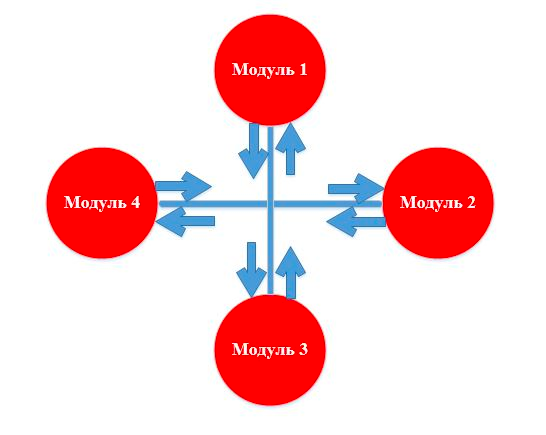

## Модульное тестирование

**Модульное тестирование (Unit testing)** – тестирование каждой атомарной функциональности приложения отдельно, в
искусственно созданной среде. Именно потребность в создании искусственной рабочей среды для определенного модуля,
требует от тестировщика знаний в автоматизации тестирования программного обеспечения, некоторых навыков
программирования. Данная среда для некоторого юнита создается с помощью драйверов и заглушек.

Объект тестирования выделен красным цветом.

**Драйвер** – определенный модуль теста, который выполняют тестируемый нами элемент.

**Заглушка** – часть программы, которая симулирует обмен данными с тестируемым компонентом, выполняет имитацию рабочей
системы.

**Заглушки нужны для:**

- Имитирования недостающих компонентов для работы данного элемента.

- Подачи или возвращения модулю определенного значения, возможность предоставить тестеру самому ввести нужное значение.

- Воссоздания определенных ситуаций (исключения или другие нестандартные условия работы элемента).

**Рассмотрим преимущества модульного тестирования.**

Прежде всего, нужно очертить рамки, в которых Юнит-тестирование оправданно. Во-первых, архитектура проекта должна быть
спроектирована в соответствии с идеями ООП (четкое деление на классы, каждый из которых выполняет свою определенную
функцию), что обеспечит систему грамотным делением на модули. Также, модульное тестирование должно быть менее затратным
при поиске дефектов, чем другие виды тестов и должно снижать время отладки кода.

Что же касается непосредственно преимуществ:

Модульное тестирование мотивирует программистов писать код максимально оптимизированным, проводить рефакторинг (
упрощение кода программы, не затрагивая ее функциональность), так как с помощью Юнит-тестирования можно легко проверить
работоспособность рассматриваемого компонента.

Необходимость отделения реализации от интерфейса (ввиду особенностей модульного тестирования), что позволяет
минимизировать зависимости в системе.

Документация Юнит-тестов может служить примером «живого документа» для каждого класса, тестируемого данным способом.

Модульное тестирование помогает лучше понять роль каждого класса на фоне всей программной системы.

Также, при «разработке через тестирование», которая активно используется в экстремальном программировании, модульное
тестирования является одним из основных инструментов, позволяющий разрабатывать модули в соответствии с требованиями к
данному модулю.
