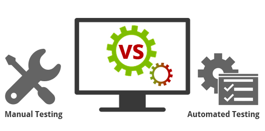

## Ручное и автоматизированное

При **ручном тестировании** (manual testing) тестировщики вручную выполняют тесты, не используя никаких средств
автоматизации. Ручное тестирование – самый низкоуровневый и простой тип тестирования, не требующих большого количества
дополнительных знаний.

Тем не менее перед тем как автоматизировать тестирование любого приложения, необходимо сначала выполнить серию тестов
вручную. Мануальное тестирование требует значительных усилий, но без него мы не сможем убедиться в том, возможна ли
автоматизация в принципе. Один из фундаментальных принципов тестирования гласит: **100% автоматизация невозможна**.
Поэтому, ручное тестирование – необходимость.

**Мифы о ручном тестировании:**

- кто угодно может провести ручное тестирование

Нет, выполнение любого вида тестирования требует специальных знаний и профессиональной подготовки.

- автоматизированное тестирование мощнее ручного

Полная автоматизация невозможна. Необходимо использовать также и ручное тестирование.

- ручное тестирование – это просто

Тестирование может быть очень непростым занятием. Проведение тестирования для проверки максимально возможного количества
путей выполнения с использованием минимального числа тест-кейсов требует серьезных аналитических навыков.

**Автоматизированное тестирование** предполагает использование специального программного обеспечения (помимо
тестируемого) для контроля выполнения тестов и сравнения ожидаемого фактического результата работы программы. Этот тип
тестирования помогает автоматизировать часто повторяющиеся, но необходимые для максимизации тестового покрытия задачи.

Некоторые задачи тестирования, такие как низкоуровневое регрессионное тестирование, могут быть трудозатратными и
требующими много времени если выполнять их вручную. Кроме того, мануальное тестирование может недостаточно эффективно
находить некоторые классы ошибок. В таких случаях автоматизация может помочь сэкономить время и усилия проектной
команды.

После создания автоматизированных тестов, их можно в любой момент запустить снова, причем запускаются и выполняются они
быстро и точно. Таким образом, если есть необходимость частого повторного прогона тестов, значение автоматизации для
упрощения сопровождения проекта и снижения его стоимости трудно переоценить. Ведь даже минимальные патчи и изменения
кода могут стать причиной появления новых багов.

**Существует несколько основных видов автоматизированного тестирования:**

– автоматизация тестирования кода (Code-driven testing) – тестирование на уровне программных модулей, классов и
библиотек (фактически, автоматические юнит-тесты);

– автоматизация тестирования графического пользовательского интерфейса (Graphical user interface testing) – специальная
программа (фреймворк автоматизации тестирования) позволяет генерировать пользовательские события – нажатия клавиш, клики
мышкой, и отслеживать реакцию программы на эти действия – соответствует ли она спецификации.

– автоматизация тестирования API (Application Programming Interface) – программного интерфейса программы. Тестируются
интерфейсы, предназначенные для взаимодействия, например, с другими программами или с пользователем. Здесь опять же, как
правило, используются специальные фреймворки.

Для составления автоматизированных тестов, QA-специалист должен уметь программировать. Автоматические тесты – это
полноценные программы, просто предназначенные для тестирования.

Когда, что и как автоматизировать и автоматизировать ли вообще – очень важные вопросы, ответы на которые должна дать
команда разработки. Выбор правильных элементов программы для автоматизации в большой степени будет определять успех
автоматизации тестирования в принципе. Нужно избегать автоматизации тестирования участков кода, которые могут часто
меняться.

**Сравнение ручного и автоматизированного тестирования**

Как ручное, так и автоматизированное тестирование могут использоваться на разных уровнях тестирования, а также быть
частью других типов и видов тестирования.

**Автоматизация сохраняет время, силы и деньги**. Однажды автоматизированный тест можно запускать снова и снова,
прилагая минимум усилий.

**Вручную можно протестировать практически любое приложение, в то время как автоматизировать стоит только стабильные
системы**. Автоматизированное тестирование используется главным образом для регрессии. Кроме того, некоторые виды
тестирования, например, ad-hoc или исследовательское тестирование могут быть выполнены только вручную.

**Мануальное тестирование может быть повторяющимся и скучным**. В то же время, автоматизация может помочь этого избежать
– за вас все сделает компьютер.

Таким образом, на реальных проектах зачастую используется комбинация ручного и автоматизированного тестирования, причем
уровень автоматизации будет зависеть как от типа проекта, так и от особенностей постановки производственных процессов в
компании.
